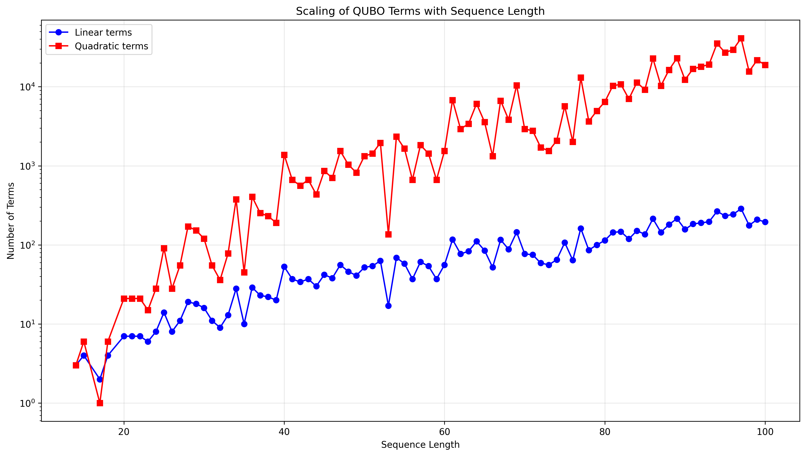

# Quantum RNA Folding with Pseudoknots

This project extends IBM's Variational Quantum Eigensolver (VQE) approach to RNA secondary structure prediction by including pseudoknots - important structural elements that were previously excluded due to their computational complexity.


## Motivation

RNA secondary structure prediction is crucial for drug design and genetic research. While IBM's recent work showed promising results using quantum computing, they excluded pseudoknots due to computational challenges. Our implementation tackles this limitation by:

1. Including pseudoknot structures in the QUBO formulation
2. Analyzing the scaling of computational resources with sequence length
3. Comparing classical and quantum solutions
4. Providing detailed visualization of results

## Computational Complexity and Quantum Advantage

The problem of RNA folding with pseudoknots is NP-complete, making it intractable for classical computers to find optimal solutions for longer sequences. VQE offers a promising alternative by:
- Leveraging quantum mechanics to explore complex solution spaces
- Providing good approximate solutions through the variational principle
- Handling the increased complexity from pseudoknot inclusion

## Quick Start

1. **Clone the repository and install requirements:**
```bash
git clone <repo-url>
cd quantum-rna-folding
pip install -r requirements.txt
```

2. **Run the following code in a new Python file, or use the built-in experiments in `experiments.py`:**
```python
# Import the required functions
from preprocess_sequence import process_rna_sequence
from quantum_optimizer import build_quadratic_program, solve_with_vqe

# Analyze a simple RNA sequence
sequence = "GCGUAAACGCG"
L, Q, stems, seq = process_rna_sequence(sequence)
qp = build_quadratic_program(L, Q)
result = solve_with_vqe(qp)
```

## Implementation Details

### QUBO Formulation
The RNA folding problem is mapped to a Quadratic Unconstrained Binary Optimization (QUBO) problem:
- Linear terms: stem energies and loop penalties (O(n) scaling)
- Quadratic terms: stem interactions and pseudoknot penalties (O(n²) scaling)

### Quantum Implementation
```python
# Available ansatz types
ANSATZ_TYPES = {
    'RealAmplitudes': 'Default, recommended for most cases',
    'TwoLocal': 'Alternative for specific topologies',
    'EfficientSU2': 'Hardware-efficient option'
}
```

Features:
- Customizable VQE implementation using Qiskit
- Multiple ansatz options with easy configuration
- Built-in timeout handling for larger sequences
- Comprehensive metric tracking (qubits, parameters, runtime)

## Results

Our analysis, run on sequences ordered by increasing complexity, shows:

1. QUBO Resource Scaling
   - Polynomial scaling in preprocessing (O(n) linear terms, O(n²) quadratic terms)
   - Tractable for moderate-length RNA sequences

   

2. VQE Runtime Analysis
   - Local execution with 10-minute timeout per sequence
   - Clear performance boundaries for different sequence complexities
   - Parameter count impact on runtime

   

3. Classical vs Quantum Comparison
   - Strong agreement for simpler sequences
   - Increasing divergence with structural complexity
   - Successful handling of pseudoknot structures

   

## VQE Parameter Analysis and Challenges

Our experiments reveal several critical aspects of VQE performance that need careful consideration:

### Current Limitations
1. **Qubit Scaling Issues**
   - Performance degrades significantly beyond 4 qubits
   - Solutions diverge from classical results with increasing qubit count
   - Potential causes:
     - Large penalty terms for overlapping structures
     - Improper energy scaling between terms
     - Insufficient exploration of solution space

2. **Parameter Sensitivity**
   - VQE performance heavily depends on:
     - Ansatz design and depth
     - Optimizer choice and hyperparameters
     - Initial parameter values
     - Number of shots for measurement

### Potential Improvements

1. **Adaptive Ansatz Design**
   - Dynamic circuit depth based on problem complexity
   - Problem-specific ansatz architectures
   - Hardware-efficient ansatz for specific RNA structures
   - Example approaches:
     ```python
     # Adaptive depth based on qubit count
     depth = min(qubit_count * 2, max_depth)
     ansatz = RealAmplitudes(num_qubits, reps=depth)
     ```

2. **Optimizer Selection**
   - SPSA (Simultaneous Perturbation Stochastic Approximation)
     - Better for noisy quantum circuits
     - More robust to measurement errors
   - COBYLA (Constrained Optimization BY Linear Approximation)
     - Derivative-free optimization
     - Good for constrained problems
   - Custom optimizers for RNA-specific energy landscapes

3. **Conditional Value at Risk (CVaR)**
   - Enhanced sampling of solution space
   - Better handling of measurement noise
   - Implementation approach:
     ```python
     from qiskit.algorithms.minimum_eigensolvers import VQEResult
     from qiskit.algorithms.optimizers import SPSA
     
     # CVaR-based VQE
     optimizer = SPSA(maxiter=100)
     vqe = VQE(
         ansatz=ansatz,
         optimizer=optimizer,
         quantum_instance=quantum_instance,
         expectation=expectation,
         include_custom=True
     )
     ```

4. **Energy Term Scaling**
   - Dynamic penalty scaling based on sequence length
   - Balanced weighting between:
     - Base pair energies
     - Loop penalties
     - Pseudoknot constraints
   - Example scaling approach:
     ```python
     # Dynamic penalty scaling
     penalty_scale = 1.0 / (sequence_length ** 0.5)
     overlap_penalty *= penalty_scale
     ```

### Future Directions
1. **Hybrid Approaches**
   - Classical preprocessing to reduce problem size
   - Quantum-classical feedback loops
   - Partial structure constraints

2. **Advanced Sampling**
   - Importance sampling for better exploration
   - Adaptive shot allocation
   - Noise-aware measurement strategies

3. **Parameter Optimization**
   - Automated hyperparameter tuning
   - Transfer learning from similar sequences
   - Online parameter adaptation

## Next Steps

### Parameter Optimization
1. Calibrate model parameters using real RNA structural data:
   - Base pair energies
   - Loop penalties
   - Pseudoknot penalties
   - Overlap constraints

2. Optimize VQE hyperparameters:
   - Ansatz design
   - Optimization algorithms
   - Shot count
   - Circuit depth

### Algorithm Improvements
1. Explore advanced VQE variants:
   - Adaptive VQE
   - Hardware-efficient ansatz designs
   - Noise-aware optimization

2. Implement hybrid approaches:
   - Classical preprocessing optimizations
   - Quantum-classical feedback loops
   - Partial structure constraints


## References

### Main Research Inspiration
1. IBM Research. (2024). "mRNA secondary structure prediction using utility-scale quantum computers." arXiv:2405.20328. [Link](https://arxiv.org/abs/2405.20328)

### RNA Structure Databases
1. Rfam Database. (2024). "RNA families database of alignments and CMs." [Link](https://rfam.org/)
2. RNAcentral. (2024). "The non-coding RNA sequence database." [Link](https://rnacentral.org/)

### Quantum Computing Resources
1. Qiskit Documentation. (2024). "Variational Quantum Eigensolver." [Link](https://qiskit.org/documentation/nature/tutorials/03_ground_state_solvers.html)
2. IBM Quantum. (2024). "Quantum Computing Resources." [Link](https://quantum-computing.ibm.com/)

### RNA Structure Prediction
1. Mathews, D. H., et al. (2004). "RNA secondary structure prediction using free energy minimization." Nucleic Acids Research, 32(8), 2648-2657.
2. Reuter, J. S., & Mathews, D. H. (2010). "RNAstructure: software for RNA secondary structure prediction and analysis." BMC Bioinformatics, 11(1), 1-9.

### Pseudoknot Analysis
1. Rivas, E., & Eddy, S. R. (1999). "A dynamic programming algorithm for RNA structure prediction including pseudoknots." Journal of Molecular Biology, 285(5), 2053-2068.
2. Ren, J., et al. (2012). "RNAstructure: an integrated package for RNA secondary structure prediction and analysis." Nucleic Acids Research, 40(W1), W94-W99.

## Experimental Results

Our experiments with RNA folding using quantum computing revealed several key insights:

### Quantum vs Classical Performance


- **Short Sequences (4-5 qubits)**: The quantum solutions using different ansatz types (RealAmplitudes, TwoLocal, EfficientSU2) show promising results, with energies close to classical solutions
- **Long Sequences (>45 qubits)**: Performance degrades significantly, with energy differences growing up to 13 kcal/mol
- **Best Performing Ansatz**: RealAmplitudes consistently performed better for shorter sequences

### Runtime Analysis


- **Exponential Scaling**: VQE runtime shows exponential growth with increasing qubit count
- **Timeout Behavior**: Most sequences beyond 45 qubits hit the 30-minute timeout
- **Parameter Count Impact**: Higher parameter counts in ansatz correlate with longer runtimes

### QUBO Resource Analysis




- **Resource Distribution**: The RNA to QUBO conversion shows a clear distribution of linear and quadratic terms
- **Scaling Pattern**: Both linear and quadratic terms scale with sequence length, but quadratic terms grow more rapidly
- **Optimization Challenge**: The increasing number of terms makes optimization more challenging for longer sequences

These results suggest that quantum computing approaches are most promising for shorter RNA sequences, while classical methods remain more efficient for longer sequences. The exponential runtime scaling indicates that current quantum optimization methods need significant improvements to handle larger RNA folding problems efficiently.

## Future Work
Based on the experimental results, potential areas for improvement include:
1. Optimizing ansatz parameters for better quantum performance
2. Exploring hybrid quantum-classical approaches
3. Investigating alternative optimization strategies for CVaR-VQE
4. Developing more efficient QUBO formulations
5. Implementing error mitigation techniques for quantum circuits
